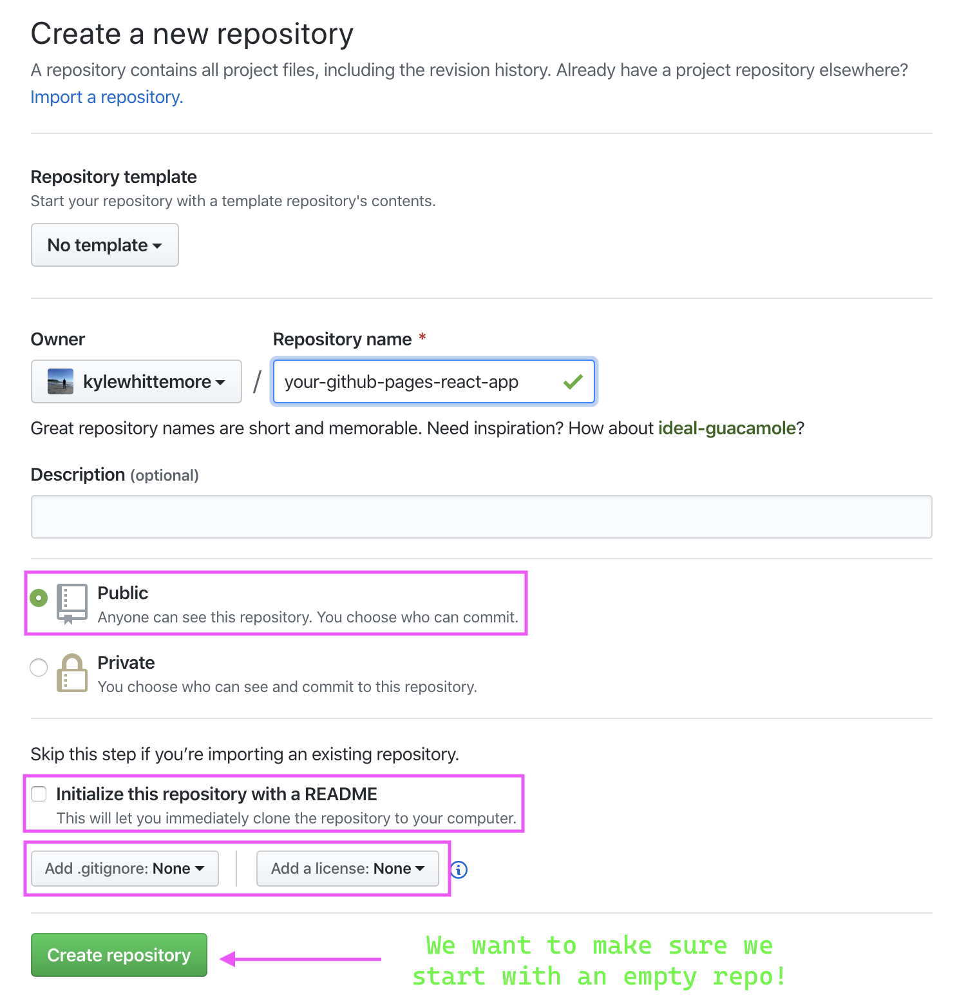
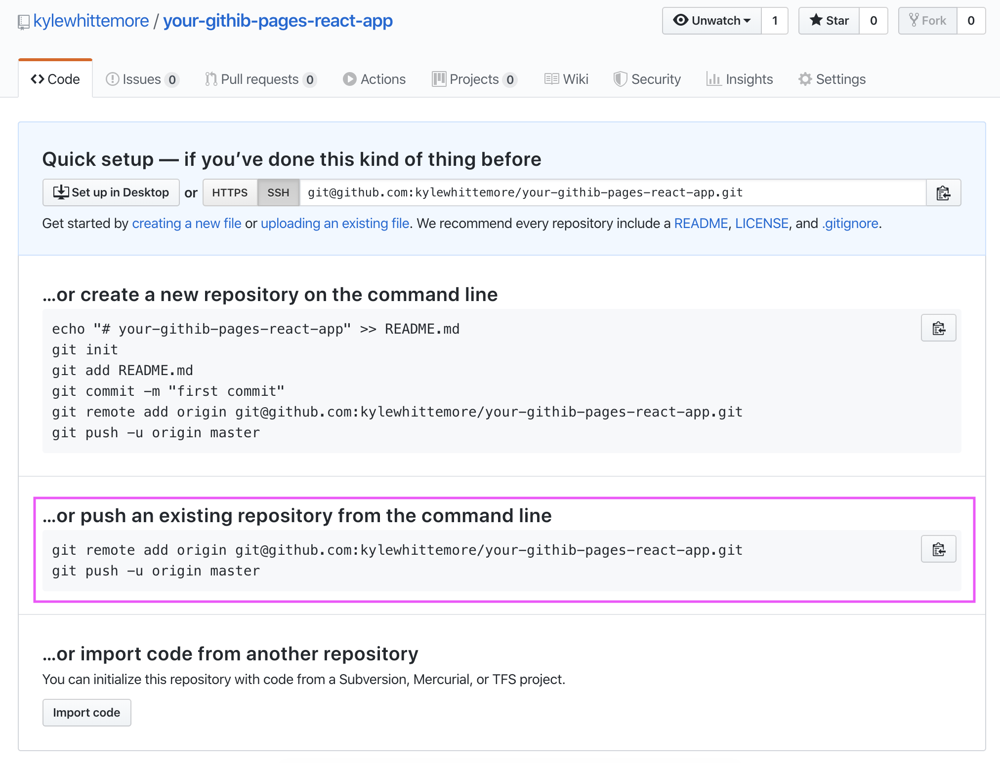
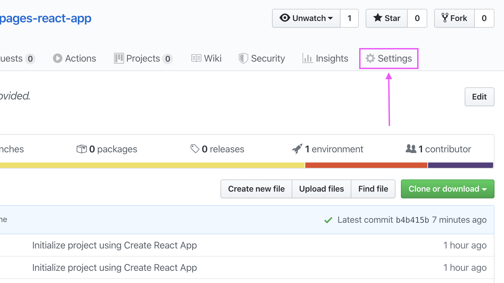
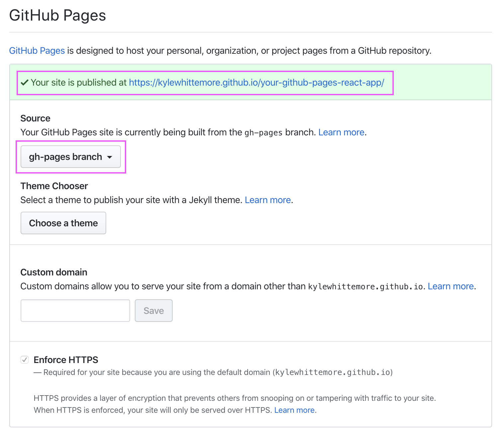

# Deploy your React App to Github Pages
### Deploying a react application to Github Pages requires an additional npm package and a couple extra steps beyond the conventional static site deployment process.

[Create-React-App Github Pages documentation](https://create-react-app.dev/docs/deployment/#github-pages)

---

Have you already tried to deploy your app to Github pages as-is?  If you do you will find that only the readme will be displayed when visiting your site.  This is because by default, github is looking for an ``index.html`` in the root of your repository, and of course there isn't one!  As you may have experienced before, when there is no ``index.html`` Github will render readme instead.

While we are working in development, we leverage the webpack configuration and hot-reloading to simulate a server, which watches for changes and re-builds the application on each change.  When we run ``npm start``, webpack takes our create-react-app and compiles it down to vanilla HTML, CSS, and JS and serves it up on a local port.

When we actually deploy the application we need to deploy the same compiled source code.  If we simply push our app up to github pages, there will be no ``build`` folder and thus no ``index.html`` as explained above.  Let's fix that!

---

## Setting up the repository:

First lets create a new create-react-app by running 
    
    npx create-react-app <your-app-name>

Once your app has been created, lets set it up as a new git repository on github.  Create a new **_empty_** repo, that is **_public_**, with the same name as the react app you just created.



Once you have created your repo on github you will be greeted with the following screen:



Copy the link in the "..or push an existing repository from the command line" section, and return to your terminal at the root of your new react app.

Now we will take our react app and point it at the github repo that we just created by running the scripts that you just copied from Github:

    git remote add origin git@github.com:<your username>/<your repository name>.git

and then push your newly configured repo up to git by running:

    git push -u origin master

If you copied the commands from github then you can just paste and both will be run. 

Now your repo is all set up, open your repo in your code editor and lets get coding!

---

## Setting up the app for deployment:

First, we need to install the recommended (by the create-react-app team) package that will handle deploying our compiled app to Github pages. We will do this by running:

    npm install gh-pages 

Now we have to adjust our ``package.json`` file with a couple new scripts and declare the homepage that will render our app.

Open your ``package.json`` file and find the ``"scripts"`` section.
```
  "scripts": {
    "start": "react-scripts start",
    "build": "react-scripts build",
    "test": "react-scripts test",
    "eject": "react-scripts eject"
  },
```

We will now add our ``"predeploy"`` and ``"deploy"`` scripts so that we can trigger a build and deployment from the command line.

First we will add our ``"deploy"`` script:

    "deploy": "gh-pages -d build"

We will execute this script by running ``npm run deploy`` in our terminal, but not yet!

Next we need to add a hook, which is a script that will run automatically when we run our ``deploy`` script.  So next we add:

    "predeploy": "npm run build"

Even though this seems redundant, by declaring it as a ``predeploy`` script it will trigger the ``build`` script automatically with every deploy as mentioned above.

The gist of these additional scripts is that first, our application will be built, and then using the ``gh-pages`` package it will be deployed to github pages.

The last step will be to declare the homepage that your users will visit to view your application.  We do this by adding a ``"homepage"`` value to our ``package.json"`` file as well. So add:

    "homepage": "https://<your username>.github.io/<your repo name>"

You can put this pretty much anywhere so long as it is not contained in another key-value object.  When you are done, it should look something like this:
```
...

  "homepage": "https://<username>.github.io/<repo name>",
  "scripts": {
    "start": "react-scripts start",
    "build": "react-scripts build",
    "test": "react-scripts test",
    "eject": "react-scripts eject",
    "predeploy": "npm run build",
    "deploy": "gh-pages -d build"
  },

...
```
---
## Deployment:

Now that we have made our configuration changes, we can do our usual git-routine to commit them to our github repo:

    git add .
    git commit -m "prepared for Github pages deployment"
    git push origin master

Finally, we need to run our deploy script:

    npm run deploy

This will trigger both the build, then deploy the build folder to our github page.

Once that has completed, then last line in your terminal should read ``published``.  Now, lets head back to our repo and go to the settings tab:



Then we will scroll down to the Github pages section and ensure that we have the ``gh-pages`` branch selected:



Alright! Now all you have do do is click the link and view your freshly deployed react application!  If you visit the link and get a ``404 error``, don't fret, it often takes a few minutes to actually be available.


