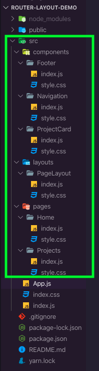
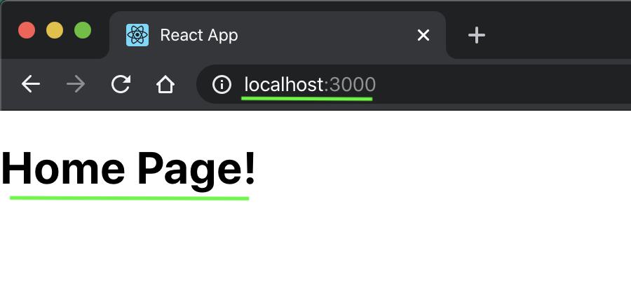
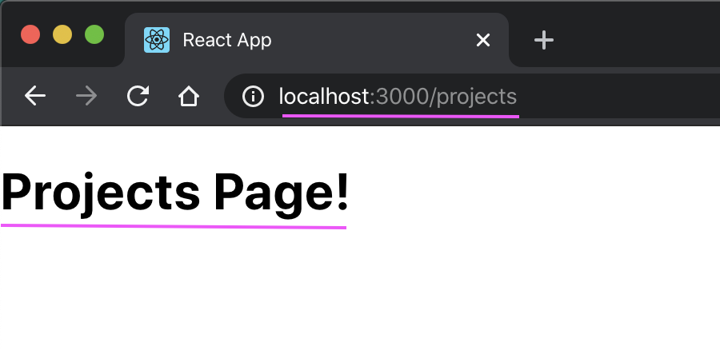

# **Using a ``<Layout>`` component and client-side routing in React**
To create a single page React app that has multiple pages, you need to implement client-side routing.  We can use the npm package ``react-router-dom`` to accomplish this.

This article will be a step-by-step walkthrough of implementing this functionality with a bonus feature where we will D.R.Y. out our code by creating a ``<Layout>`` component that will render our static components so they don't have to be included on every page.

We will be stepping through creating a basic portfolio site to demonstrate the technique.

---

First create a new react app and clear out the boilerplate that we dont need.

    $ npx create-react-app router-layour-demo
    $ cd router-layout-demo/src
    $ rm -rf App.css App.test.js setupTests.js serviceWorker.js logo.svg

Then remove the references to the stuff we deleted from the ``App.js`` and ``index.js`` files and clear out the JSX in the return of the ``<App />`` component:

```javascript
import React from 'react';

function App() {
  return (
    // Router will go here
  );
}

export default App;
```

Now we need to install our routing library.  Go back to the root of your project and install ``react-router-dom``:

    $ cd ../
    $ npm i react-router-dom

Now lets scaffold out our application by creating the folders and files for our pages and components.  Your filesystem should look something like below, depending on your preferences for applying styles and naming conventions:



---

## **Now that we have our boilerplate setup, let's get a minimal router setup**

For this tutorial we will be using ``react-bootstrap`` to get us up and running with some pre-built components:

    $ npm i react-bootstrap bootstrap

Lets set up the router first.  We will need to import our routing components from ``react-router-dom`` to our ``App.js`` file.  

```javascript
// src/App.js
import { BrowserRouter as Router, Route, Switch } from 'react-router-dom';
```

Now we will declare a ``<Router>`` component to wrap our ``<Switch>`` and ``<Route>`` components in, and two ``<Route>`` components for our ``Home`` and ``Project`` pages.  

```javascript
// src/App.js

import React from 'react';
import { BrowserRouter as Router, Route, Switch } from 'react-router-dom';

function App() {

  return (
    <Router>
      <Switch>
        <Route />
        <Route />
      </Switch>
    </Router>
  );
}

export default App;
```

We still need to add the paths and page components that we will actually be routing to, but first we will need to create them.

Lets open up ``src/pages/Home/index.js`` and add some code.

```javascript
// src/pages/Home/index.js

import React from 'react';

export default function() {

    return (
        <h1>Home Page!</h1>
    )
}
```

We do not need to name our function, we will name it when we import it.  Copy the code and paste it into the Projects page component as well, but change the header to reflect that we are on the ``Projects`` page.

```javascript
// src/pages/Projects/index.js
import React from 'react';

export default function() {

    return (
        <h1>Projects Page!</h1>
    )
}
```

Head back to ``App.js`` and include the two new page components.

```javascript
import Home from './pages/Home/index.js';
import Projects from './pages/Projects/index.js';
```
and then finish writing our ``<Route>`` components:

```javascript
    <Route exact path='/' component={Home}/>
    <Route path='/projects' component={Projects}/>
```

Now we can start the application by running

    $ npm start

in our terminal.  If we go to our page in the browser we should see that we are on the homepage:



and if we add ``/projects`` to the url in the browser bar we will end up at the projects page:



Great! The router is now working at a basic level and we have tow pages ready for content.

---