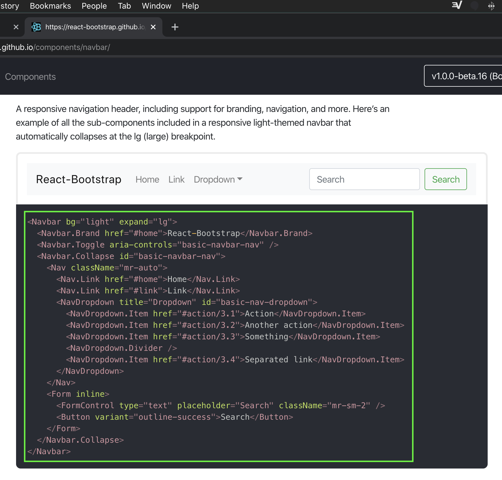
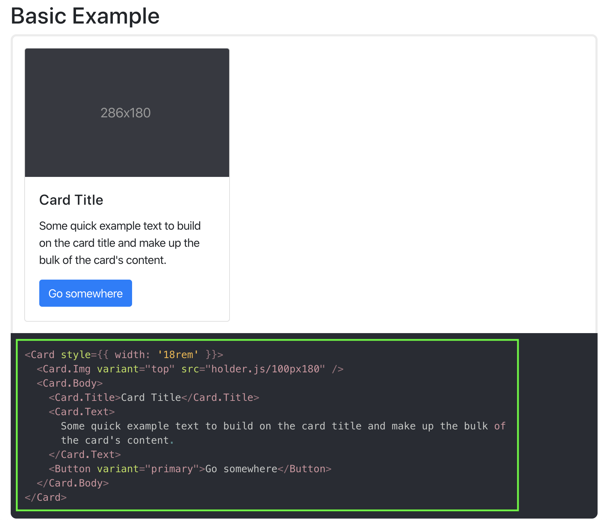
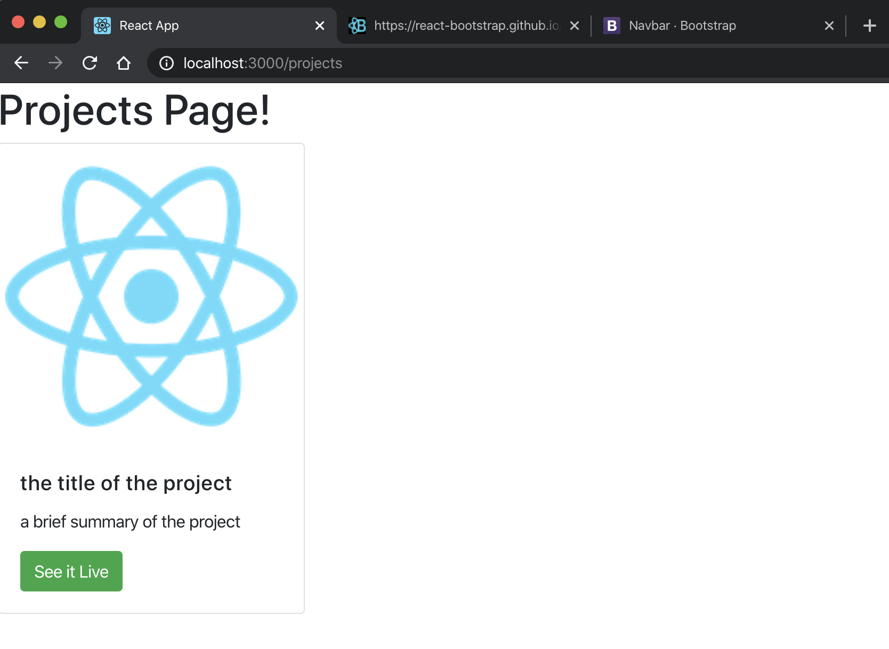

# **Using a ``<Layout>`` component and client-side routing in React**
To create a single page React app that has multiple pages, you need to implement client-side routing.  We can use the npm package ``react-router-dom`` to accomplish this.

This article will be a step-by-step walkthrough of implementing this functionality with a bonus feature where we will D.R.Y. out our code by creating a ``<Layout>`` component that will render our static components so they don't have to be included on every page.

We will be stepping through creating a basic portfolio site to demonstrate the technique.

---

First create a new react app and clear out the boilerplate that we dont need.

    $ npx create-react-app router-layour-demo
    $ cd router-layout-demo/src
    $ rm -rf App.css App.test.js setupTests.js serviceWorker.js logo.svg

Then remove the references to the stuff we deleted from the ``App.js`` and ``index.js`` files and clear out the JSX in the return of the ``<App />`` component:

```javascript
import React from 'react';

function App() {
  return (
    // Router will go here
  );
}

export default App;
```

Now we need to install our routing library.  Go back to the root of your project and install ``react-router-dom``:

    $ cd ../
    $ npm i react-router-dom

Now lets scaffold out our application by creating the folders and files for our pages and components.  Your filesystem should look something like below, depending on your preferences for applying styles and naming conventions:


---

## **Now that we have our boilerplate setup, let's get a minimal router setup**

For this tutorial we will be using ``react-bootstrap`` to get us up and running with some pre-built components:

    $ npm i react-bootstrap bootstrap

and then import the bootstrap stylesheet into ``index.sj``

```javascript
// src/index.js

import 'bootstrap/dist/css/bootstrap.min.css';
```

Lets set up the router first.  We will need to import our routing components from ``react-router-dom`` to our ``App.js`` file.  

```javascript
// src/App.js
import { BrowserRouter as Router, Route, Switch } from 'react-router-dom';
```

Now we will declare a ``<Router>`` component to wrap our ``<Switch>`` and ``<Route>`` components in, and two ``<Route>`` components for our ``Home`` and ``Project`` pages.  

```javascript
// src/App.js

import React from 'react';
import { BrowserRouter as Router, Route, Switch } from 'react-router-dom';

function App() {

  return (
    <Router>
      <Switch>
        <Route />
        <Route />
      </Switch>
    </Router>
  );
}

export default App;
```

We still need to add the paths and page components that we will actually be routing to, but first we will need to create them.

Lets open up ``src/pages/Home/index.js`` and add some code.

```javascript
// src/pages/Home/index.js

import React from 'react';

export default function() {

    return (
        <h1>Home Page!</h1>
    )
}
```

We do not need to name our function, we will name it when we import it.  Copy the code and paste it into the Projects page component as well, but change the header to reflect that we are on the ``Projects`` page.

```javascript
// src/pages/Projects/index.js

import React from 'react';

export default function() {

    return (
        <h1>Projects Page!</h1>
    )
}
```

Head back to ``App.js`` and include the two new page components.

```javascript
import Home from './pages/Home/index.js';
import Projects from './pages/Projects/index.js';
```
and then finish writing our ``<Route>`` components:

```javascript
    <Route exact path='/' component={Home}/>
    <Route path='/projects' component={Projects}/>
```

The final result should be:

```javascript
import React from 'react';
import { BrowserRouter as Router, Route, Switch } from 'react-router-dom';
import Home from './pages/Home/index.js';
import Projects from './pages/Projects/index.js';

function App() {

  return (
    <Router>
      <Switch>
        <Route exact path='/' component={Home}/>
        <Route path='/projects' component={Projects}/>
      </Switch>
    </Router>
  );
}

export default App;
```

Now we can start the application by running

    $ npm start

in our terminal.  If we go to our page in the browser we should see that we are on the homepage:


and if we add ``/projects`` to the url in the browser bar we will end up at the projects page:


Great! The router is now working at a basic level and we have two pages ready for content.

---

# Part 2:

Creating the basic components

Go to ``src/components/Navigation/index.js`` and create a basic functional component, importing ``Navbar`` and ``Nav`` from ``react-bootstrap``:

```javascript
import React from 'react';
import { Navbar, Nav } from 'react-bootstrap';

export default function () {
    return (

    )
}
```

Now lets go to the ``react-bootstrap`` website and copy a ``navbar``.



and paste it into our ``Navigation`` component, but removing a bunch of stuff we aren't interested in in this tutorial like the form and dropdown.  Then lets add the two paths we decalared for our pages above.  We will replace the ``"#home"`` ``href``s in the brand and home links with ``'/'``.  Replace the ``"#link"`` ``href`` with ``'/projects'`` and change the text to ``Projects``.  When you are done it should look like this:

```javascript
export default function () {
    return (
        <Navbar bg="light" expand="lg">
            <Navbar.Brand href="/">React-Bootstrap</Navbar.Brand>
            <Navbar.Toggle aria-controls="basic-navbar-nav" />
            <Navbar.Collapse id="basic-navbar-nav">
                <Nav className="mr-auto">
                    <Nav.Link href="/">Home</Nav.Link>
                    <Nav.Link href="/projects">Projects</Nav.Link>
                </Nav>
            </Navbar.Collapse>
        </Navbar>
    )
}
```

This should give us a serviceable navbar that we can import into the home page to test out by stacking the ``<Navigation />`` component above the header and wrapping them both in a ``div``.

```javascript
// src/pages/Home/index.js

import React from 'react';
import Navigation from '../../components/Navigation/index.js'

export default function () {

    return (
        <div>
            <Navigation />
            <h1>Home Page!</h1>
        </div>
    )
}
```

Take a look at the homepage in your browser and you will see a simple navbar!  Lets make a footer!

This will basically be a rinse-and-repeat of the Navigation component to get us going, but in the end it will be worth writing out as its own component.

Go to the ``<Navigation>`` component that you just built and copy the whole thing, then go to ``src/components/Footer/index.js`` and paste it in.

But we aren't interested in the collapse/toogle feature in a footer so we will cut that out, and we need this to be a footer so we will add a bootstrap class ``bottom`` to fix it to the bottom of the window for now.    

```javascript
export default function () {
    return (
        <Navbar bg="light" className='fixed-bottom' expand="lg">
            <Navbar.Brand href="#home">Footer</Navbar.Brand>
            <Nav className="mr-auto">
                <Nav.Link href="#home">Home</Nav.Link>
                <Nav.Link href="#link">Link</Nav.Link>
            </Nav>
        </Navbar>
    )
}
```

The final basic component that we will be building is a ``<ProjectCard>`` that will have an image, title, description for each of our projects and button link to their demo's.

Let's head back to the ``react-bootstrap`` components area and find ourselves a card.



Same as before, copy the component code and build out another functional component in the ``src/components/ProjectCard/index.js`` file.

```javascript
import React from 'react';
import { Card, Button } from 'react-bootstrap';

export default function () {

    return (
        <Card style={{ width: '18rem' }}>
            <Card.Img variant="top" src="holder.js/100px180" />
            <Card.Body>
                <Card.Title>Card Title</Card.Title>
                <Card.Text>
                    Some quick example text to build on the card title and make up the bulk of
                    the card's content.
                </Card.Text>
                <Button variant="primary">Go somewhere</Button>
            </Card.Body>
        </Card>
    )
}
```

Since we need to pass data to the card component so that they can be dynamically rendered for each project in our portfolio, we will pass a ``props`` called ``projectCard`` that will be an object. For example:

```javascript
const projectCard = {
    imageSrc: './logo192.png',
    title: 'the title of the project',
    description: 'a brief summary of the project',
    link: 'https://linktoyourproject.com,
}
```

So let's clean up our component and make it render the project that is passed to it as props.  We will add ``props`` as an argument passed to our component function, and remove the rest of the unnecessary placeholders.  It should look like this:

```javascript
export default function (props) {

    return (
        <Card style={{ width: '18rem' }}>
            <Card.Img variant="top" src="" />
            <Card.Body>
                <Card.Title></Card.Title>
                <Card.Text></Card.Text>
                <Button variant="primary"></Button>
            </Card.Body>
        </Card>
    )
}
```

Now we add the props in to make this a dynamic component, and add some text to our button.  Let's also switch to the 'success' green color:

```javascript
export default function (props) {

    return (
        <Card style={{ width: '18rem' }}>
            <Card.Img variant="top" src={props.projectCard.imageSrc} />
            <Card.Body>
                <Card.Title>{props.projectCard.title}</Card.Title>
                <Card.Text>{props.projectCard.description}</Card.Text>
                <Button variant="success">See it Live</Button>
            </Card.Body>
        </Card>
    )
}
```
Time to test it out.  Open ``src/pages/Projects/index.js``, import the ``ProjectCard`` component that we just built and past in the example project card described above.  Add it below the header and wrap the two components in a ``<div>`` You should end up with:

```javascript
// src/pages/Projects/index.js

import React from 'react';
import ProjectCard from '../../components/ProjectCard/index.js';

export default function () {
    const projectCard = {
        //add a logo to test out
        imageSrc: './logo192.png',
        title: 'the title of the project',
        description: 'a brief summary of the project',
        link: 'https://linktoyourproject.com',
    }

    return (
        <div>
            <h1>Projects Page!</h1>
            <ProjectCard projectCard={projectCard} />
        </div>

    )
}
```

You will need to copy the logo image from ``public/logo192.png`` and put in the Projects page folder at ``src/pages/Projects``.  Of course, we are just using this as a placeholder.  Let's take a look in the browser.



Alright, so now we have come pretty far - we have a couple pages and the three primary componets that we need for our site.  It wouldn't be a very big burden to include the ``<Navigation />`` and ``<Footer />`` components on our two pages, but let's do it using a static layout component.  

Open up ``src/layouts/PageLayout/index.js``, set it up for a basic functional react component and import the ``<Navigation />`` and ``<Footer />`` components:

```javascript
import React from 'react';
import Navigation from '../../components/Navigation/index.js';
import Footer from '../../components/Footer/index.js';

export default function() {

    return (

    )
}
```

The next steps will make more sense if we go back to ``src/App.js`` and take a look at what we are really trying to accomplish.  

Basically we want to do two things in ``src/App.js`` before setting up our layout.  First we need to turn our built-out router into a component of its own.  Create a new function in the ``src/App.js`` file that we will call ``RouterComponent``:

```javascript
const RouterComponent = () => {
    return (

    )
}
```

Cut the whole ``Router`` into this new function:

```javascript
const RouterComponent = () => {
  return (
    <Router>
      <Switch>
        <Route exact path='/' component={Home}/>
        <Route path='/projects' component={Projects}/>
      </Switch>
    </Router>
  )
}
```

Import the ``<PageLayout />`` component we started building:

```javascript
import PageLayout from './layouts/PageLayout/index.js'
```

The goal here is going to be to wrap the ``<RouterComnponent>`` in our ``<PageLayout>`` component so that the static content in the ``<PageLayout>`` component will always be displayed while the ``<RouterComponent>`` handles the dyanmic content displayed as different 'pages'.  

```javascript
// src/App.js

import React from 'react';
import { BrowserRouter as Router, Route, Switch } from 'react-router-dom';
import Home from './pages/Home/index.js';
import Projects from './pages/Projects/index.js';
import PageLayout from './layouts/PageLayout/index.js'

const RouterComponent = () => {
  return (
    <Router>
      <Switch>
        <Route exact path='/' component={Home}/>
        <Route path='/projects' component={Projects}/>
      </Switch>
    </Router>
  )
}

function App() {
  return (
    <PageLayout>
      <RouterComponent />
    </PageLayout>
  );
}

export default App;
```
When we do this we need to tell the ``<PageLayout>`` component to render the ``<RouterComnponent>`` as ``{ children }``.  Go back to ``src/`layouts/PageLayout/index.js`` and pass ``props.children`` as the argument.  Then, add the ``<Navigation />`` and ``<Footer />`` components and wrap them in a ``<div>``.  In between them, we will render ``props.children``, which in this case is the ``<Router>`` component, by inserting it between ``{ }``.


```javascript
import React from 'react';
import Navigation from '../../components/Navigation/index.js';
import Footer from '../../components/Footer/index.js';

export default function(props) {

    return (
        <div>
            <Navigation />
            { props.children }
            <Footer />
        </div>
    )
}
```

Now we need to remove the ``<Navigation>`` and ``<Footer>`` components from the home page since otherwise we would end up with two headers and footers.  Then, take a look in the browser.  We can now click between two pages that both have the static header and footer.

OK thats enough for Part II.  to recap, in this article we built out the three main components we need to scaffold out our portfolio site - the navbar, footer, and project card.  We created a ``<PageLayout>`` component and moved the ``router`` to its own component, ``<RouterComponent>`` that is passed to ``<PageLayout>`` as children. 

In Part III. we will add our project data, and build it out so that it will responsively render a card for each of our projects.

---

# Part III.  
